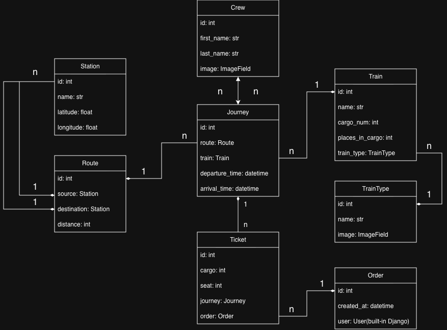

# Railway API

Railway station API service for booking train tickets, built with Django REST Framework.

The service lets passengers browse journeys between stations, see how many seats are
still available and book tickets, while the staff manages stations, routes, trains and
crews. Authentication is done with JWT.

## Features

* JWT authentication with registration, token obtaining, refreshing and verification
* Managing orders with several tickets at once, created in a single transaction
* Seat validation: a ticket cannot be booked twice or point to a non-existent carriage or seat
* Number of available seats calculated for every journey in a single query
* Filtering journeys by departure date, source and destination station
* Uploading images for train types and crew members
* Admin panel at `/admin/`
* API documentation at `/api/doc/swagger/` and `/api/doc/redoc/`
* Request throttling: 10 requests per minute for anonymous users, 30 for authenticated ones
* Test suite covering models, permissions, filtering, image uploads and orders

## Running with Docker

Docker and Docker Compose should be installed.

```shell
git clone https://github.com/rinotokun/railway-api-service.git
cd railway-api-service
```

Create a `.env` file in the project root using `.env.sample` as a template:

```shell
cp .env.sample .env
```

Fill it in, for example:

```
DJANGO_SECRET_KEY=your-secret-key
POSTGRES_DB=railway
POSTGRES_PORT=5432
POSTGRES_USER=railway_user
POSTGRES_PASSWORD=railway_password
POSTGRES_HOST=db
PGDATA=/var/lib/postgresql/data
```

Start the service:

```shell
docker-compose up
```

The API is now available at `http://127.0.0.1:8000/`. Migrations are applied
automatically on startup, so the only thing left is to create an admin account:

```shell
docker-compose exec app python manage.py createsuperuser
```

## Getting access

Every endpoint except registration and token obtaining requires authentication.

1. Create a user via `POST /api/user/register/` with `username` and `password`.
2. Get a token pair via `POST /api/user/token/` with the same credentials.
3. Send the `access` token in the `Authorization` header of every request:

```
Authorization: Bearer <access token>
```

The access token is valid for one day, the refresh token for three days. When the
access token expires, get a new one via `POST /api/user/token/refresh/`.

Regular users can browse the railway data and manage their own orders. Creating
stations, routes, trains, crews and journeys and uploading images is allowed for
staff users only, so use the superuser account created above for that.

## Database structure



## Endpoints

### User

| Endpoint | Methods | Description |
|---|---|---|
| `/api/user/register/` | POST | Create a new account |
| `/api/user/token/` | POST | Obtain an access and a refresh token |
| `/api/user/token/refresh/` | POST | Refresh the access token |
| `/api/user/token/verify/` | POST | Verify a token |
| `/api/user/me/` | GET, PUT, PATCH | View and update your own profile |

### Railway

| Endpoint | Methods | Description |
|---|---|---|
| `/api/railway/stations/` | GET, POST | Stations |
| `/api/railway/routes/` | GET, POST | Routes between two stations |
| `/api/railway/routes/{id}/` | GET | Route with full station data |
| `/api/railway/train-types/` | GET, POST | Train types |
| `/api/railway/train-types/{id}/upload-image/` | POST | Upload a train type image |
| `/api/railway/trains/` | GET, POST | Trains |
| `/api/railway/crews/` | GET, POST | Crew members |
| `/api/railway/crews/{id}/upload-image/` | POST | Upload a crew member image |
| `/api/railway/journeys/` | GET, POST | Journeys with the number of available seats |
| `/api/railway/journeys/{id}/` | GET, PUT, PATCH | Journey with its taken seats |
| `/api/railway/orders/` | GET, POST | Your orders, paginated by 10 |
| `/api/railway/orders/{id}/` | GET, PUT, PATCH, DELETE | A single order of yours |

### Filtering journeys

| Parameter | Example |
|---|---|
| `departure_date` | `/api/railway/journeys/?departure_date=2026-05-13` |
| `source` | `/api/railway/journeys/?source=Lviv` |
| `destination` | `/api/railway/journeys/?destination=Kyiv` |

Parameters can be combined: `/api/railway/journeys/?source=Lviv&destination=Kyiv`.

## Booking a ticket

An order is created together with its tickets in one request to
`POST /api/railway/orders/`:

```json
{
  "tickets": [
    {"cargo": 1, "seat": 12, "journey": 1},
    {"cargo": 1, "seat": 13, "journey": 1}
  ]
}
```

If any ticket in the list is invalid — the seat is already taken or the carriage
number is out of the train range — the whole order is rejected and nothing is saved.

## Running tests

```shell
docker-compose run app sh -c "python manage.py test"
```
